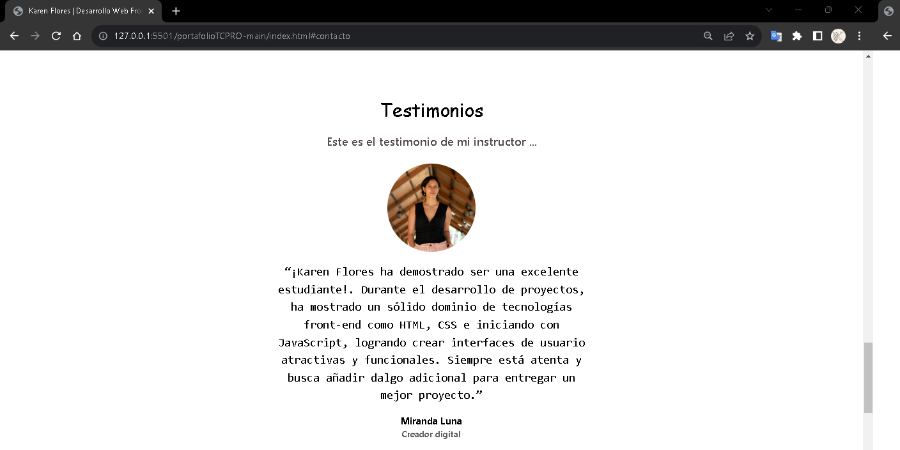

# Portafolio Adaptable (Responsive) con Bootstrap 5

Este proyecto creado para el bootcamp Tecnolochicas PRO, es una página web adaptable a dispositivos de distintos tamaños (este tipo de sitio web se conoce en inglés como "responsive"). 

El propósito de esta página web es mostrar mi portafolio de proyectos al comenzar a desenvolverme como desarrolladora y registrando la experiencia que voy obteniendo.

Desde mi infancia, la programación ha sido una presencia constante en mi vida, influenciada por mis padres y algunos familiares que estudiaron ciencias de la computación. A medida que crecía, me cautivaban las nuevas tecnologías y aplicaciones que se desarrollaban, lo que despertó en mí la curiosidad por aprender cómo crearlas y explorar mi creatividad en ese campo.

Cuando tuve la oportunidad de participar en la beca de Santander de Tecnolochicas Pro, experimenté un significativo punto de inflexión. Esta experiencia me permitió ampliar mis conocimientos y adentrarme en el mundo de la programación web, específicamente en HTML y CSS. Durante el programa, tuve la oportunidad de desarrollar diversos proyectos, aplicando los conceptos aprendidos en clase de manera práctica y estimulante.

Además, mi carrera universitaria también contribuyó a mi crecimiento en este ámbito. En una materia específica, pude llevar a cabo proyectos adicionales que me permitieron consolidar lo aprendido en el curso de Tecnolochicas. Esta combinación de conocimientos teóricos y prácticos me proporcionó una sólida base para seguir explorando y avanzando en el apasionante campo de la programación y la tecnología. Cada día, siento que mi entusiasmo y dedicación hacia esta disciplina aumentan, y espero seguir contribuyendo con mi creatividad e ideas innovadoras en el mundo de las tecnologías emergentes.

### Capturas de pantalla:

Primera parte de la página web:

Experiencia:

Proyectos:

Testimonios:

Contacto:

## Tecnologías

Esta página web fue creada con:

* HTML
* CSS
* JavaScript 
* Bootstrap 5

Además, se incluyeron **Google Fonts** para personalizar la fuente y **Bootstrap icons** para incorporar íconos como flechas y logos de plataformas donde pueden encontrar mis proyectos que he realizado.

## Español

El texto de la página web está escrito en español, al igual que las clases y atributos personalizados. Las clases relacionadas con Bootstrap se incluyeron en inglés.

